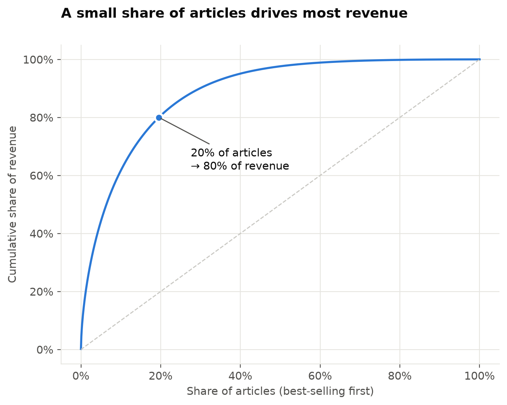
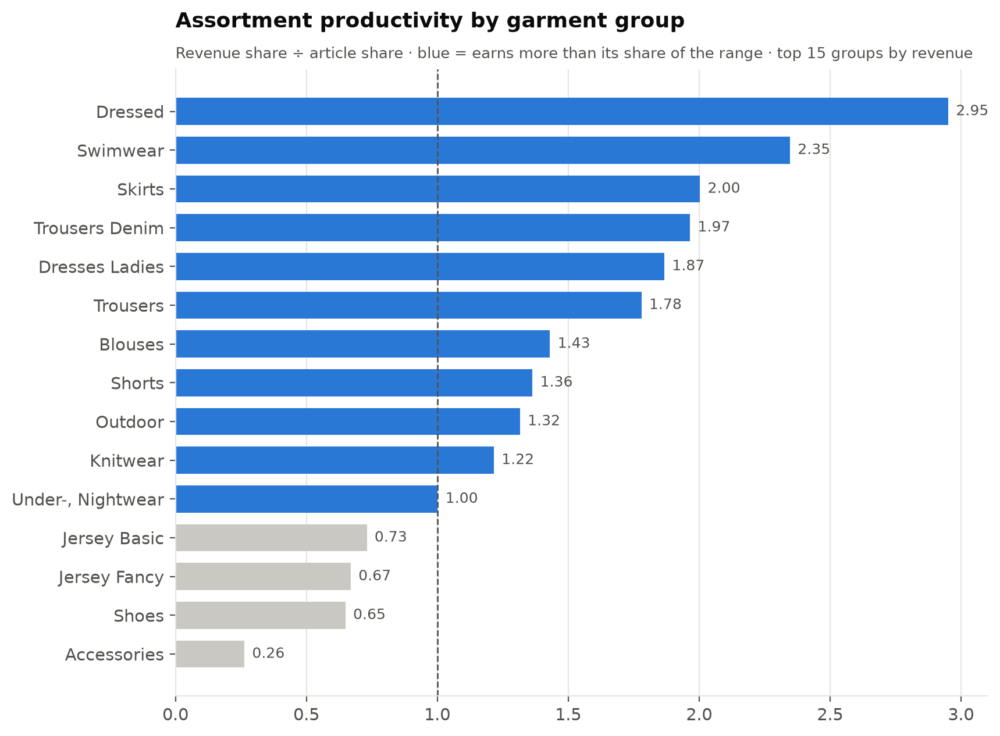
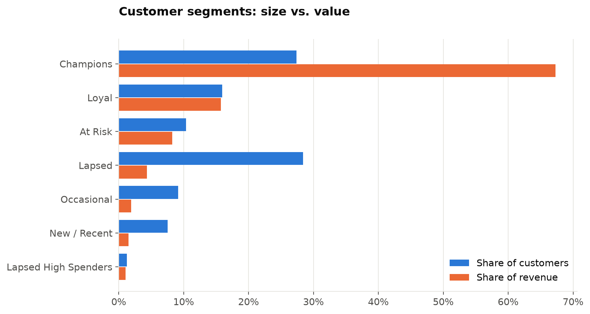
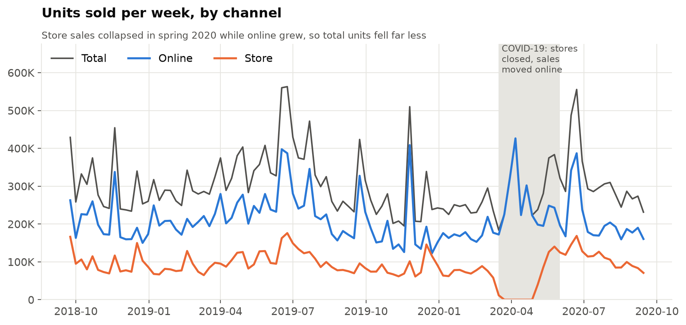
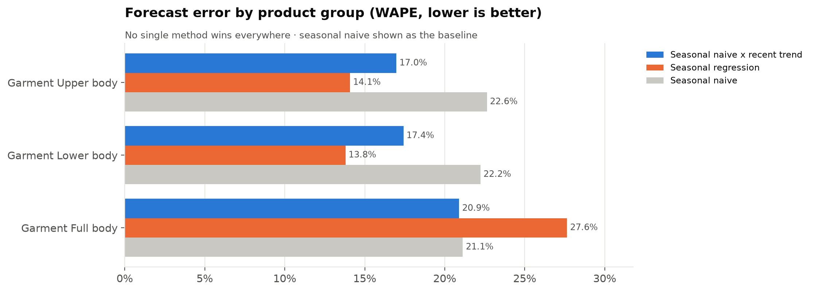
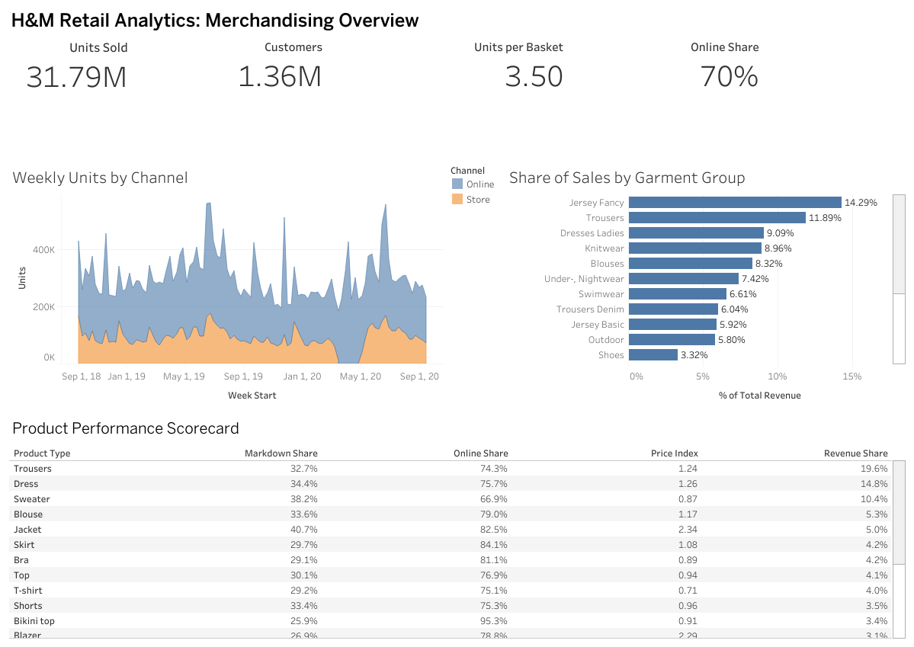

# Fashion Retail Intelligence

An end-to-end merchandising and customer analytics project using **31 million H&M
transactions**, combining SQL, Python, forecasting and an interactive dashboard to answer
the questions a fashion retailer's merchandising, planning and CRM teams ask every season.

> **Interactive dashboard:** [view on Tableau Public](https://public.tableau.com/app/profile/madeleine.lacoste/viz/HMRetailMerchandisingAnalytics/MerchandisingOverview)

## Business Questions

1. **Merchandising:** Which categories drive sales, how efficiently is the assortment
   working, and how dependent is the business on markdowns?
2. **Customer behavior:** Who are the most valuable customers, how well are new customers
   retained, and which first purchases bring people back?
3. **Trends & demand:** How seasonal is demand, which categories and colours are gaining
   share, and how accurately can simple methods forecast the next quarter?

## Tools & Technologies

- SQL (DuckDB)
- Python: pandas, NumPy, Matplotlib, scikit-learn
- Jupyter Notebook
- Tableau Public
- GitHub

## Dataset

[H&M Personalized Fashion Recommendations](https://www.kaggle.com/competitions/h-and-m-personalized-fashion-recommendations)
(Kaggle), September 2018 to September 2020:

| Table | Rows | Contents |
|---|---|---|
| `transactions_train` | ~31.8M | Date, customer, article, price, sales channel (one row per unit) |
| `customers` | ~1.37M | Age, club membership status, fashion-news subscription |
| `articles` | ~105K | Product type, product group, garment group, department, colour |

Prices in the dataset are scaled by H&M, so all results are expressed as **shares, ratios
and indexes** rather than currency.

## Approach

| Area | Methods |
|---|---|
| Assortment performance | Revenue share, **productivity index** (revenue share ÷ article share), price index |
| Concentration | Pareto curve of article revenue, long-tail share by garment group |
| Markdown | Inferred markdown rate: units sold 15%+ below each article's reference price |
| Lifecycle & newness | Selling weeks per article, share of seasonal revenue from new launches |
| Customer value | Purchase-frequency distribution, **RFM segmentation** (7 segments) |
| Retention | Monthly **cohort retention**, 90-day repeat rate by first-basket category |
| Customer profile | Age-band spending mix, channel preference, loyalty-club engagement |
| Basket analysis | Garment-group pairs with **lift** |
| Trends | Seasonality index, year-over-year share shifts in category / colour / product type |
| Forecasting | 12-week hold-out comparison of four methods, scored with **WAPE** |

## Key Findings

- **Assortment concentration:** 19.5% of articles generate 80% of revenue, while the
  bottom half of the range generates only 2.4%. A relatively small set of products carries
  most of the commercial value.
- **Productivity:** Dressed (2.95×), Swimwear (2.35×), Skirts (2.0×) and Denim (1.97×) earn
  far more than their share of the assortment. Accessories sit at 0.26×: 11% of articles
  but 3% of revenue. Jersey Fancy is the largest garment group by revenue, yet at 0.67× its
  footprint in the range is even larger than its sales contribution.
- **Markdown exposure:** about 33% of units sell at least 15% below their reference price,
  rising to 46% in Socks and Tights and 41% in Outdoor. These categories are candidates for
  a closer look at initial buy depth, pricing and demand alignment; the data shows where
  markdowns concentrate, not why.
- **Customer value:** Champions are 27% of customers but 67% of revenue, and customers who
  shop both online and in store are 36% of customers but 68% of revenue. Lapsed customers
  make up 28% of the base but only 4% of revenue. Value is concentrated among highly
  engaged, omnichannel shoppers (a descriptive pattern, not evidence that omnichannel use
  causes higher spend).
- **Retention:** 37.5% of new customers buy again within 90 days. Across most first-basket
  garment groups the rate falls in a narrow 36–41% band, so no single entry category
  stands out as a driver of short-term retention.
- **Channel shift:** during the COVID-19 store closures (16 Mar – 31 May 2020), store units
  fell 65% versus the same weeks of 2019 while online units rose 7%, leaving total units
  down 15%. Online absorbed much of the drop in store activity but did not fully offset it.
- **Forecasting:** seasonal regression is most accurate for Upper body (14.1% WAPE) and
  Lower body (13.8%), while seasonal naive × recent trend wins for Full body (20.9% vs.
  27.6%). No single method is best across product groups, which supports choosing the
  forecasting method group by group.

## Selected Visualizations

**A small share of articles drives most revenue**



**Assortment productivity by garment group**



**Customer segments: size vs. value**



**Weekly units by channel, including the COVID-19 store closures**



**Forecast error by product group**



## Dashboard

**[H&M Retail Analytics on Tableau Public](https://public.tableau.com/app/profile/madeleine.lacoste/viz/HMRetailMerchandisingAnalytics/MerchandisingOverview)**:
KPI summary, weekly units by channel, category mix and a product-type scorecard.

[](https://public.tableau.com/app/profile/madeleine.lacoste/viz/HMRetailMerchandisingAnalytics/MerchandisingOverview)

The dashboard is built from the CSV extracts written by `scripts/export_dashboard_data.py`;
see [`dashboard/README.md`](dashboard/README.md) for the build guide.

## Recommendations

These are starting points for further analysis rather than final decisions: the data has
no inventory or margin information, and the findings are descriptive.

1. **Review the long tail while protecting high-productivity categories.** With 80% of
   revenue coming from under a fifth of articles, low-selling articles in groups with low
   productivity (Accessories, Jersey Fancy) are the first candidates for range
   rationalization. Groups earning well above their range share, such as Dressed,
   Swimwear, Skirts and Denim, should keep their depth, and any cuts should be checked
   against margin and stock data before acting.
2. **Investigate markdown-heavy categories.** For Socks and Tights, Outdoor and other
   groups where 40%+ of units sell on markdown, compare initial buy quantities, option
   counts and price points with realised demand to see whether over-buying, pricing or
   timing explains the discounting.
3. **Focus CRM on retaining high-value and omnichannel customers, and test win-back.**
   Protect the Champions and omnichannel segments, which generate about two-thirds of
   revenue, through loyalty and personalisation. Run controlled tests (for example
   targeted offers against a holdout group) to see whether lapsed customers can be
   reactivated profitably and whether encouraging a second channel lifts spend.
4. **Choose forecasting methods by product group.** Rather than applying one method to
   the whole assortment, back-test candidate methods per product group each planning
   cycle and use the best performer for each, since the most accurate method differs
   between Upper, Lower and Full body.

## Repository Structure

```
fashion-retail-intelligence/
├── data/                   # raw data goes here (not committed) – see data/README.md
├── sql/
│   ├── 00_build_tables.sql       # summary tables built once from the raw data
│   ├── 01_overview.sql           # dataset overview and monthly KPIs
│   ├── 02_merchandising.sql      # category, concentration, markdown, lifecycle, colour
│   ├── 03_customers.sql          # frequency, RFM, cohorts, repeat rate, age, channel, baskets
│   ├── 04_trends.sql             # seasonality, YoY shifts, momentum, forecast inputs
│   └── 05_dashboard.sql          # extracts for Tableau
├── notebooks/
│   ├── 01_merchandising.ipynb
│   ├── 02_customer_behavior.ipynb
│   ├── 03_trends_and_forecasting.ipynb
│   └── source/                   # plain-Python versions of the notebooks
├── src/hm_analytics/             # query runner, chart style, forecasting
├── scripts/                      # build database, build notebooks, export dashboard data
├── dashboard/                    # Tableau build guide (extract CSVs are generated locally)
└── images/                       # charts saved by the notebooks
```

Every SQL query is named (`-- name: monthly_kpis`) and the notebooks load them by name, so
the SQL files are the single source of truth and can also be run directly in the DuckDB CLI.

## How to Run

```bash
pip install -r requirements.txt
# 1. Download the three CSVs into data/raw/ (see data/README.md)
python scripts/build_database.py            # add --customer-pct 20 on a low-memory laptop
python scripts/build_notebooks.py
jupyter nbconvert --to notebook --execute --inplace notebooks/*.ipynb
python scripts/export_dashboard_data.py
```

To test the pipeline without the download, `scripts/make_sample_data.py` generates a small
**synthetic** dataset with the same columns (results from it are meaningless):

```bash
python scripts/make_sample_data.py
python scripts/build_database.py --raw-dir data/sample --db data/hm_sample.duckdb
HM_DB=data/hm_sample.duckdb jupyter nbconvert --to notebook --execute --inplace notebooks/*.ipynb
```

## Limitations

- **No inventory or stock data**, so true sell-through can't be measured; markdowns and
  lifecycles are inferred from prices and sales dates.
- **Scaled prices** mean results are relative, not in currency.
- **Left and right censoring:** customers and articles already active when the data starts
  look "new", and recent ones haven't had time to mature; the analysis excludes edge
  periods where this matters.
- **COVID-19** closed stores in spring 2020: store sales collapsed while online sales grew,
  which affects year-over-year and channel comparisons.
- **"Special Offers" and "Unknown"** garment groups (under 2% of units) are not product
  categories, so they are left out of garment-group comparisons but kept in totals.
- **Channel codes are undocumented**; channel 2 is treated as online, as is common practice
  with this dataset.
- Findings are **descriptive**, not causal.

## Data Source

H&M Group. *H&M Personalized Fashion Recommendations*, Kaggle competition dataset (2022).
The data is used under the competition's terms for non-commercial analysis and is not
redistributed in this repository.
